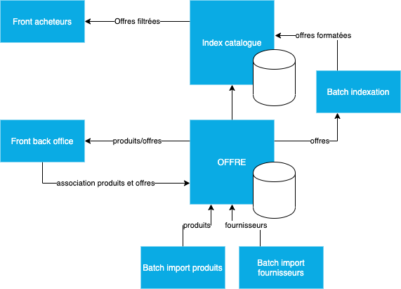

# Architecture appliacative et scénarios de flux

## Briques applicatives de la solution

[Outil: draw.io](https://www.draw.io/)
[Fichier source sur le repo: ./architecture.drawio](./architecture.drawio)

## Scénarios des cas complexes

* [Import et indexation d'un catalogue produit](./scenarios/products_import_index.md)
* ...
